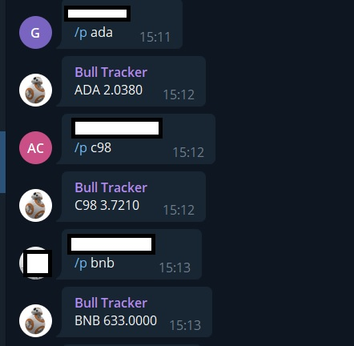

## Table of contents

- [Overview](#overview)
  - [Goal](#the-challenge)
  - [Screenshot](#screenshot)
  - [Links](#links)
  - [Built with](#built-with)
- [Author](#author)

## Overview

### Goal

Users should be able to:

- Send command to the Telegram bot and ask for coin prices from Binance.
- "/p eth" will return Ethereum Prices
- "/price btc" will return Bitcoin Prices
- Users can add their bots to their channels or chats. Bot also will respond on there. Bot have to promoted as an ADMIN.

### Screenshot

### Built with

- Python
- Binance API v3 Ticker 
- Telethon
- Requests

## Author

- Muhammet Fatih Gül